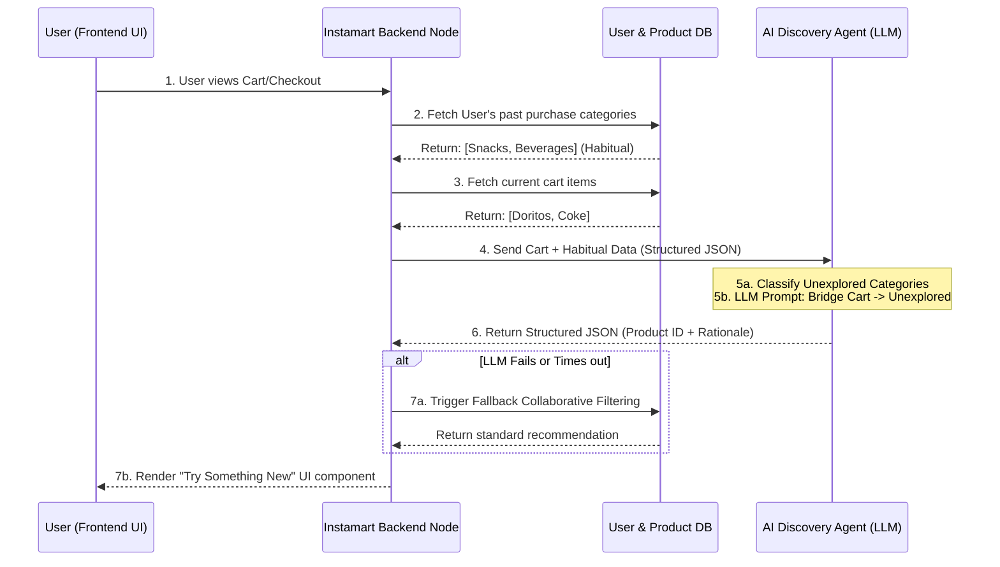

# System Architecture: Contextual "Detour" Engine

## 1. Overview
The "Detour" engine is an AI-powered discovery workflow designed to seamlessly integrate into the Swiggy Instamart checkout journey. It acts as a real-time agent that analyzes a user's current cart and historical data to recommend products from entirely new, unexplored categories, breaking repetitive shopping habits.

## 2. High-Level Architecture Diagram

The system follows a synchronous, API-driven architecture where the AI reasoning sits as a middleware service between the frontend application and the product catalog.

## 3. Core Components

### A. Frontend (Client Application)
*   **Role:** Renders the user interface, strictly mimicking the authentic look and feel of the Swiggy Instamart app (using their brand colors, typography, and card layouts).
*   **"What's New" (Detour) UI Component:** A specialized, non-intrusive UI element that appears before final payment. It displays the AI-recommended product alongside the *rationale* generated by the AI (e.g., "Since you are buying late-night snacks, how about a refreshing face wash for tomorrow morning?").

### B. Application Backend (The Orchestrator)
*   **Role:** Manages the API routes, handles authentication, and orchestrates the flow of data between the database and the AI Engine.
*   **Classification Service:** A lightweight deterministic function that compares the user's historical purchase categories against the entire catalog to explicitly define the "Unexplored Categories" list.

### C. AI Discovery Agent (LLM Service)
*   **Role:** The core reasoning engine. Takes the structured context and generates the creative cross-category recommendation.
*   **System Prompting Strategy:**
    *   **Input:** Current Cart Items, Time of Day, List of Unexplored Categories.
    *   **Task:** Select ONE category from the Unexplored list. Select ONE product from that category. Write a 1-sentence creative rationale connecting the cart items to the new product.
    *   **Constraints:** Return ONLY a strict JSON object. Do not recommend restricted items.
*   **Model Options:** OpenAI (GPT-4o-mini) or Anthropic (Claude 3 Haiku) optimized for low-latency JSON generation.

### D. Data Layer
*   **User Profiles:** Stores purchase history to track habitual categories.
*   **Product Catalog:** Vectorized or indexed product data allowing the AI Agent to quickly retrieve valid Product IDs matching its recommendation logic.

## 4. Failure Mitigation & Guardrails
As a non-deterministic AI system, robust fallbacks are critical:
1.  **Strict Schema Enforcement:** The LLM API call will use "Structured Outputs" (or function calling) to guarantee the response matches the required `{ "productId": "123", "rationale": "..." }` schema.
2.  **Inventory Validation:** The Backend will verify that the `productId` returned by the LLM actually exists and is in stock before sending it to the Frontend.
3.  **Latency Fallback:** If the LLM takes longer than `X` milliseconds or fails validation, the backend instantly falls back to a standard deterministic recommendation (e.g., "Frequently bought together") so the user experience is never blocked.
